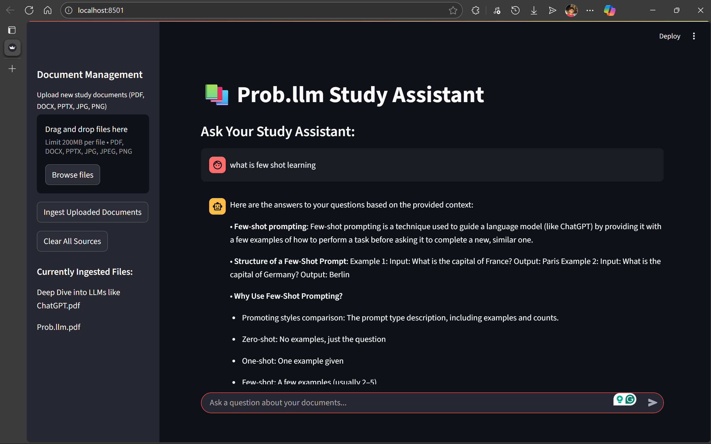
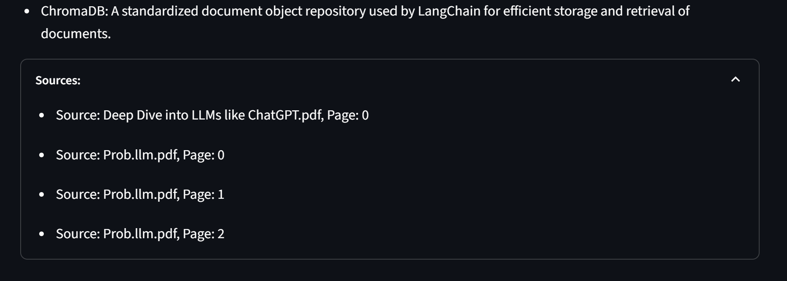

# 📚 Prob.llm - AI-Powered Study Assistant

A powerful low-resource RAG study assistant that answers academic questions using student-provided materials like **PDFs, PPTs, DOCs, txt and Images.**
Prob.llm combines combines **BM25** and **Semantic Search** with **Reciprocal Rank Fusion (RRF)** for intelligent document analysis and question answering.



## 🌟 Features
- **Hybrid Retrieval System** - BM25 Retrieval & Semantic Search for both Keyword-based search for exact term matching & Vector-based similarity search using embeddings
- **Multi-Format Document Support** - support for PDFs, PPTs, DOCs, txt and Images
- **Local LLM Integration**
   - **Ollama Integration**: Local LLM deployment with `llama3.2:1b` & High-quality text embeddings with `nomic-embed-text`
   - **Custom Prompting**: Structured, point-wise answer formatting [prompt](prompt.txt)
- **User-Friendly Interface**
      Uses **Streamlit Web App**, which is a clean interface, **Document Management** for easy upload and ingestion & **Source Citations** to view source documents for answers



## 🚀 Quick Start

### Prerequisites

1. **Python 3.8+** installed on your system
2. **Ollama** installed and running ([Download Ollama](https://ollama.ai/))


### Installation

1. **Clone the repository**
   ```bash
   git clone https://github.com/deeptanshukumar/Prob.llm.git
   cd Prob.llm
   ```
2. **Set up a virtual environment**
   ```bash
   python -m venv venv
   ```
3. **Activate the virtual environment Windows:**
   ```bash
   venv/Scripts/activate
   ```
   **macOS/Linux:**
   ```bash
   source venv/bin/activate
   ```
2. **Install dependencies**
   ```bash
   pip install -r requirements.txt
   ```

3. **Set up Ollama models**
   ```bash
   # Install the LLM model
   ollama pull llama3.2:1b   
   # Install the embedding model
   ollama pull nomic-embed-text
   ```

4. **Run the application**
   ```bash
   streamlit run streamlit_app.py
   ```

5. **Open your browser** and navigate to `http://localhost:8501`

## 📖 Usage & How It Works (RAG Pipeline)

### Document Processing
- Loads and processes PDFs and text documents
- Splits content into manageable chunks with overlap
- Generates embeddings for semantic search
### Retrieval System
- Implements hybrid search combining:
- BM25 for keyword-based retrieval
- Vector similarity for semantic search
- Uses Reciprocal Rank Fusion (RRF) to combine results
### Question Answering
- Processes natural language questions
- Retrieves relevant document chunks
- Generates accurate, context-aware answers

  
uses **LLAMA3.2:1B**, which is 1.3 GB in model size and offers fast and intelligent answers to users' queries

[RAG pipeline](Assets/RAGpipeline.png) Project Architecture

## 📂 File Structure (Overview)

```
prob_llm_assistant/
├── core/                    # Core functionality modules
│   ├── document_loaders.py  # Multi-format document loading
│   ├── text_processing.py   # Chunking and preprocessing
│   ├── vector_store.py      # ChromaDB vector operations
│   ├── retrieval.py         # Hybrid retrieval (BM25 + Semantic + RRF)
│   └── llm_interface.py     # Ollama LLM integration
├── streamlit_app.py         # Web interface
├── main.py                  # Core orchestration logic
└── requirements.txt         # Dependencies
```

## ⚙️ Configuration

### **Model Configuration** (in `main.py`)
```python
EMBEDDING_MODEL_NAME = "nomic-embed-text"  # Ollama embedding model
LLM_MODEL_NAME = "llama3.2:1b"             # Ollama LLM model
```

### **Retrieval Parameters**
```python
# Chunking settings
chunk_size = 1000      # Characters per chunk
chunk_overlap = 200    # Overlap between chunks

# Retrieval settings
k = 10                 # Documents retrieved per method
bm25_weight = 0.5      # BM25 importance weight
semantic_weight = 0.5  # Semantic search importance weight
```

## 🔧 Advanced Usage
- **Custom Prompting**
Edit `prompt.txt` to customise the AI's response style:
- **Different LLM Models**
For better performance, you can use different models:
Just `ollama pull <model name>` and change the model name in the code file
- **Batch Document Processing**
Place multiple documents in `uploaded_docs/` and restart the app for batch processing.

### **System Requirements**
- **RAM**: 4GB minimum, 8GB recommended
- **Storage**: 2GB for models + document storage
- **CPU**: Modern multi-core processor recommended
- **GPU**: Optional, but improves performance if supported by Ollama

## 📄 License
This project is licensed under the MIT License - see the [LICENSE](LICENSE) file for details.

## 🙏 Acknowledgments

- **[LangChain|🦜️🔗](https://www.langchain.com/)**: Framework for LLM applications, Document Loaders, 
- **[Ollama](https://ollama.com/)**: Local LLM deployment platform
- **[Chroma | 🦜️🔗 LangChain](https://python.langchain.com/docs/integrations/vectorstores/chroma/)**: Vector database for embeddings
- **[Streamlit](https://streamlit.io/)**: Web application framework
- **[Text splitters | 🦜️🔗 LangChain](https://python.langchain.com/docs/concepts/text_splitters/)**
**Learnings About RAG from**
- [Nvidia RAG 101](https://developer.nvidia.com/blog/rag-101-demystifying-retrieval-augmented-generation-pipelines/)
- [Nvidia Best Chunking Strategy](https://developer.nvidia.com/blog/finding-the-best-chunking-strategy-for-accurate-ai-responses/)
- [Introduction to RAG](https://weaviate.io/blog/introduction-to-rag)
  

**The Main RAG pipeline and its functioning were made by [Deeptanshu Kumar](https://github.com/deeptanshukumar)**

The user interface for this application was rapidly prototyped using AI assistance [Frontend](streamlit_app.py) to focus development efforts on the core RAG backend.
